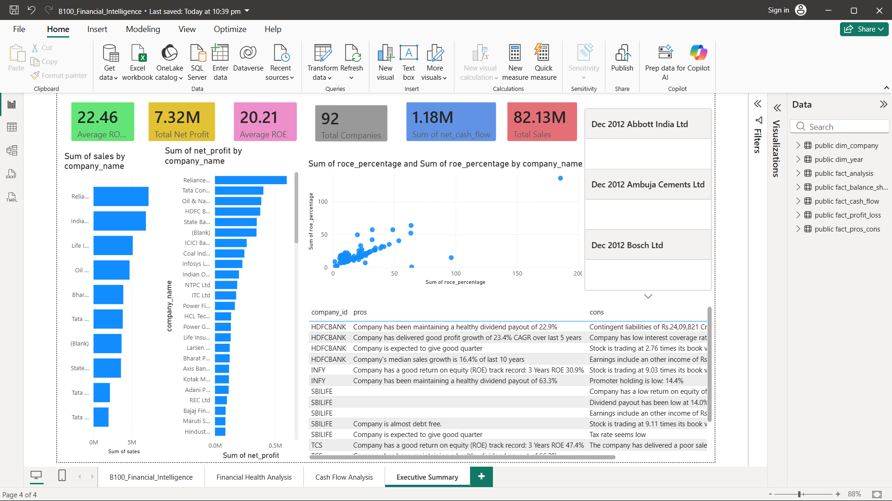
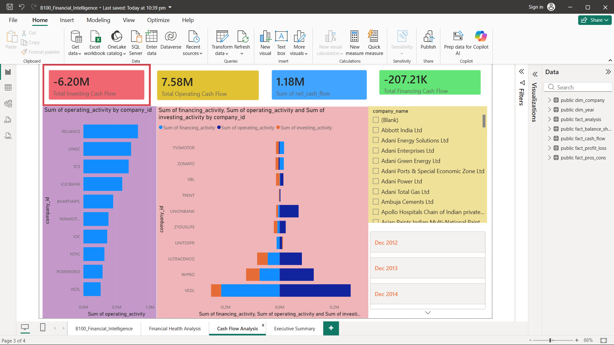

# B100 Financial Intelligence Platform

## Project Overview

B100 Financial Intelligence Platform is an end-to-end financial analytics project built using Python, PostgreSQL, and Power BI. The project processes raw financial statement data from multiple companies, performs ETL operations, calculates financial performance metrics, stores transformed data in a PostgreSQL data warehouse, and presents insights through interactive Power BI dashboards.

---

## Objectives

- Build a complete financial analytics pipeline.
- Automate data cleaning and transformation.
- Calculate key financial performance indicators.
- Design a PostgreSQL data warehouse.
- Create interactive dashboards for business intelligence and decision-making.

---

## Tech Stack

### Programming
- Python
- Pandas

### Database
- PostgreSQL

### Visualization
- Power BI

### Version Control
- Git
- GitHub

---

## Project Architecture

Raw Financial Data
↓
Python ETL Pipeline
↓
Data Cleaning & Transformation
↓
Financial KPI Calculation
↓
PostgreSQL Data Warehouse
↓
Power BI Dashboard
↓
Business Insights

---

## Dataset Overview

The project utilizes financial datasets including:

- Profit & Loss Statements
- Balance Sheets
- Cash Flow Statements
- Company Information
- Financial Analysis Data
- Pros and Cons Analysis

Total records processed: 5000+

---

## ETL Pipeline

### Data Loading
- Imported multiple CSV datasets.
- Validated file structures and schema consistency.

### Data Cleaning
- Removed duplicates.
- Standardized year formats.
- Handled missing values.
- Converted data types.

### Data Transformation
- Created analytical datasets.
- Prepared warehouse-ready tables.

### Financial Metrics Calculation
Calculated:

- Debt-to-Equity Ratio
- Equity Ratio
- Net Profit Margin
- Expense Ratio
- Interest Coverage Ratio
- Free Cash Flow

---

## PostgreSQL Data Warehouse

### Dimension Tables
- dim_company
- dim_year

### Fact Tables
- fact_profit_loss
- fact_balance_sheet
- fact_cash_flow
- fact_analysis
- fact_pros_cons

---

## Power BI Dashboards

### Financial Health Analysis
- ROE Analysis
- ROCE Analysis
- Company Comparison
- Financial Performance KPIs

### Profitability Analysis
- Total Sales
- Net Profit
- Company Ranking

### Cash Flow Analysis
- Operating Cash Flow
- Investing Cash Flow
- Financing Cash Flow
- Net Cash Flow Trends

---

## Key Insights

- Compared profitability across companies.
- Identified companies with strong cash flow positions.
- Evaluated capital efficiency using ROE and ROCE.
- Analyzed financial health through ratio-based metrics.

---

## Dashboard Screenshots

### Executive Dashboard

### Financial Health Dashboard

### Cash Flow Dashboard

---

## Repository Structure

├── data/
├── etl/
├── sql/
├── powerbi/
├── screenshots/
├── README.md
├── requirements.txt

---

## Power BI File

Location:

powerbi/B100_Financial_Intelligence.pbix

---

## Future Enhancements

- Streamlit Deployment
- Automated Data Refresh
- Predictive Financial Analytics
- Financial Risk Scoring Model

---

## Author

Pateru Raghu

GitHub:
https://github.com/Raghupateru

LinkedIn:
https://linkedin.com/in/pateru-raghu
